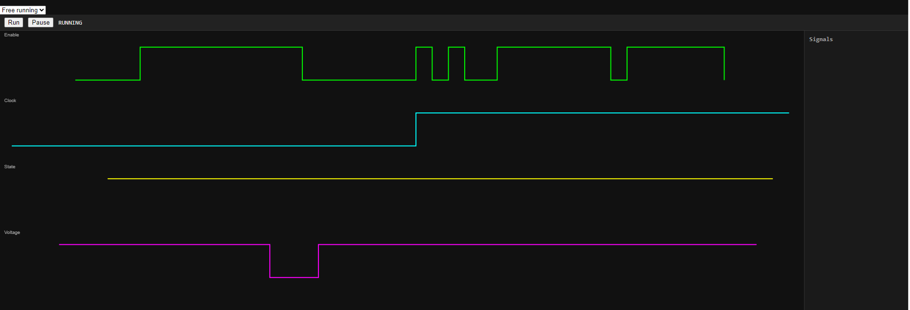
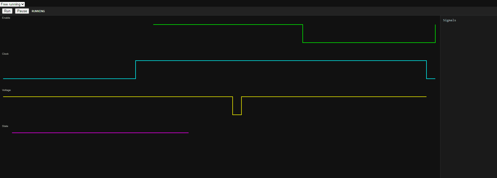

# :rocket: DebugVision

### _The Software Oscilloscope for Developers_

DebugVision turns your code into something you can _see_.

Instead of digging through logs or guessing performance issues, DebugVision lets you instrument your code with lightweight **sample points** and visualize runtime behavior like an oscilloscope - live, interactive, and precise.

---

## :sparkles: What is DebugVision?

DebugVision is an open-source tool for **visual debugging and profiling**.

It helps you:

- :bar_chart: Visualize timing and performance (latency, jitter, spikes)
- :dart: Trigger on specific events in your code
- :mag: Zoom into problem areas with high precision
- :brain: Understand complex runtime behavior at a glance

> Oscilloscope :point_right: but for your software.

---

## :gear: How it works

1. Add **sample points** to your code
2. Run your application
3. Watch your system behavior unfold visually

You can:

- Track loop timing (min / max / average)
- Inspect execution paths
- Detect anomalies and performance regressions
- Build custom visualizations for your domain

---

## :globe_with_meridians: Architecture & Language Support

DebugVision is **not tied to a single programming language**.

### :brain: Backends

- :zap: C++ backend (high-performance, low-level instrumentation)
- :snake: Python backend (rapid prototyping & flexibility)
- :heavy_plus_sign: Designed to support **any language** via extensible adapters

If you can emit structured runtime data, you can plug into DebugVision.

---

### :art: Frontend (Work in Progress)

The visualization layer is still evolving ? and this is a great place to contribute.

Strong directions we are exploring:

- :globe_with_meridians: In-browser UI (cross-platform, zero install)
- :zap: JavaScript-based visualization
- :gear: WebAssembly for performance-critical parts
- :package: Modern frameworks like Svelte

> The frontend is intentionally open-ended ? your ideas can shape it.

---

## :dart: Why DebugVision?

Debugging shouldn?t feel like guessing.

Traditional tools:

- Logs ? too noisy
- Breakpoints ? too slow
- Profilers ? too abstract

DebugVision gives you:

- :zap: Real-time insight
- :art: Visual clarity
- :jigsaw: Flexible instrumentation

---

## :camera: Example Use Cases

- Game loops (frame timing, spikes)
- Embedded systems
- Robotics / control loops
- High-performance backend systems
- Experimental projects & learning

---

## :seedling: New here? You?re welcome.

You don?t need to be an expert to contribute.

This project is especially friendly to:

- :cherry_blossom: Beginners in C++ / systems programming
- :mortar_board: Students learning about performance & debugging
- :woman_technologist: People from underrepresented groups in tech

If you?re curious, motivated, and want to learn?you belong here.

---

## :bulb: Contributing

We?re building something ambitious, and we need help.

You can contribute by:

- Fixing bugs
- Improving the UI/UX
- Building frontend experiments :eyes:
- Adding language backends
- Writing docs or tutorials
- Suggesting ideas

:point_right: Check out: `good first issue` to get started

---

## :hammer_and_wrench: Vision

We want DebugVision to become:

> The go-to tool for understanding software behavior visually.

Not just for experts?but for _any developer who wants clarity_.

---

## :heart: Join Us

If you've ever thought:

> "There must be a better way to understand what my code is doing..."

You're in the right place.

---

## :link: Getting Started

- git clone https://github.com/CobaltFusion/DebugVision.git
- do to the /fastapi/ directory and run 'start.bat' on windows to get a first impression.

## Screenshot of the /fastapi prototype

[]
[]
